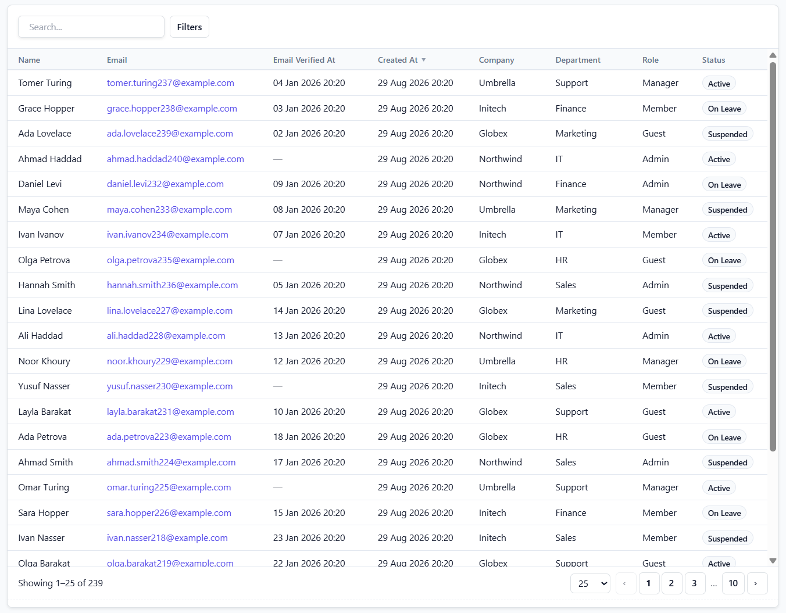
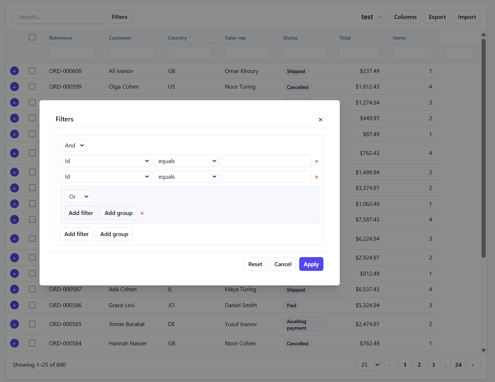
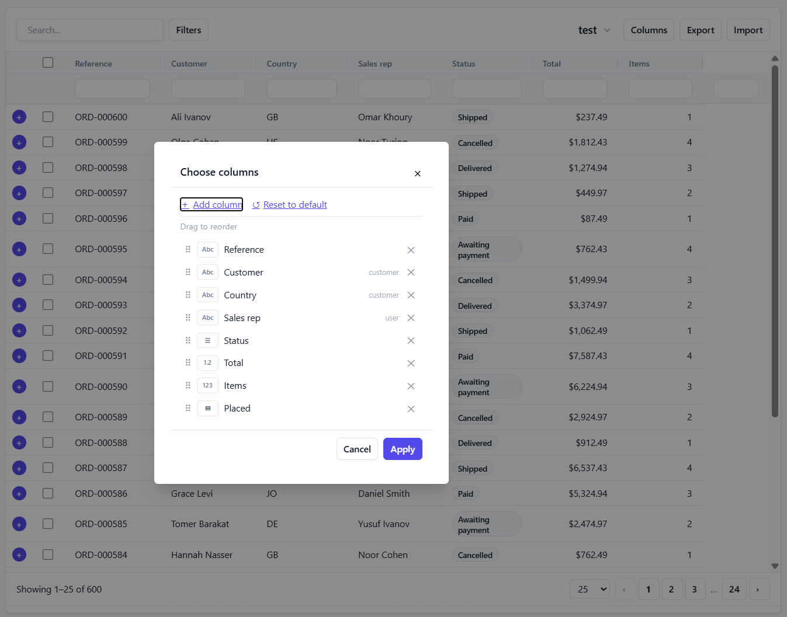
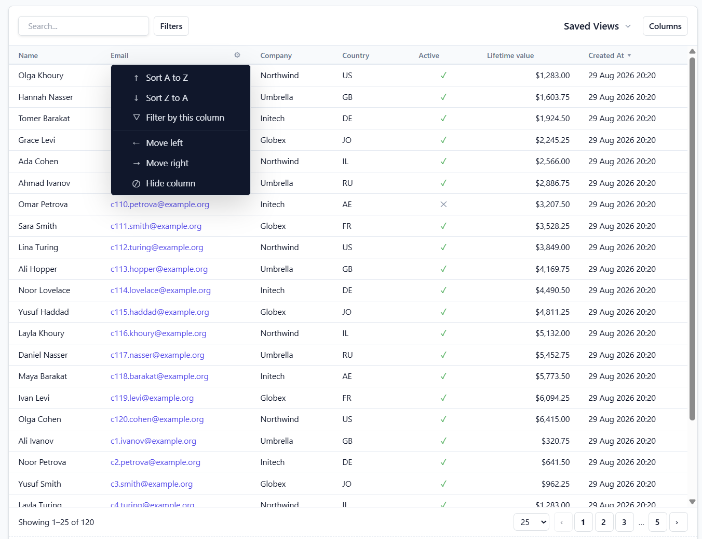
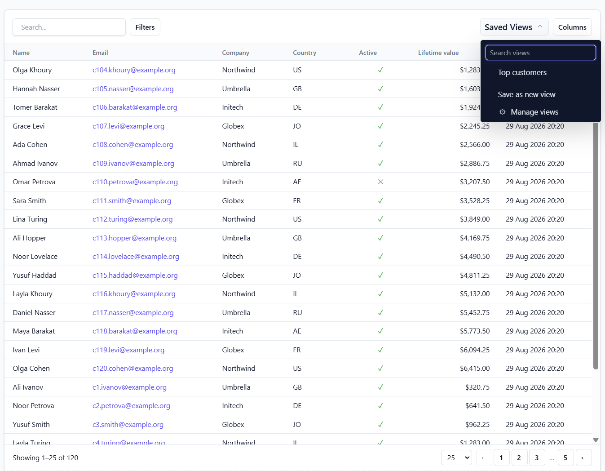

# Laravel DynamicTable

**Maximum functionality with minimum configuration.**

A fast, zero-configuration data grid for Laravel. Point it at a model and you
get columns, search, filters, sorting, pagination, relationships, saved views,
export, import and inline editing — server-side, secure, and without an N+1 in
sight.

```php
class UsersTable extends DynamicTable
{
    protected string $model = User::class;
}
```

```blade
@dynamicTable(UsersTable::class)
```

That's it. No `Column::make()` chain per field. No Livewire tag. No custom Blade
component. No route-as-table. No build step.

<!--
    Screenshots. Drop the files into docs/screenshots/ using these exact
    names and they appear here — nothing else needs editing. See
    docs/screenshots/README.md for what each one should show.
-->




<table>
<tr>
<td width="50%"></td>
<td width="50%"></td>
</tr>
<tr>
<td align="center"><em>Nested AND/OR filters</em></td>
<td align="center"><em>Add any column, including through relations</em></td>
</tr>
<tr>
<td></td>
<td></td>
</tr>
<tr>
<td align="center"><em>Dynamics-style column menu</em></td>
<td align="center"><em>Saved views, shared per user</em></td>
</tr>

</table>

---

## Install

```bash
composer require shwaeki/laravel-dynamictable
```

Nothing to publish. Nothing to build. Run `php artisan migrate` only if you want
saved views.

```bash
php artisan make:dynamic-table UsersTable
```

---

## What you get for free

Point it at a model and DynamicTable reads the schema, the casts and the
relationships, then makes sensible decisions:

- **`department_id` becomes the department's name** — eager loaded, one extra
  query for the whole page, never one per row
- Booleans render as checks, enums as badges with their cases as filter options,
  dates in the current locale, decimals right-aligned
- `password`, `remember_token` and anything token-shaped are never exposed
- Server-side search, sorting and pagination
- The advanced filter builder, with grouped AND/OR conditions
- RTL when the locale is Arabic or Hebrew

## Turn on what you need

Expensive things are opt-in. A disabled feature renders no UI, loads no
JavaScript, registers no state and runs no queries.

```php
protected array $features = [
    'views', 'export', 'import',
    'bulk-actions', 'inline_edit',
    'column_picker', 'bulk_edit',
];
```

## Customise only where you want to

```php
protected function columns(): array
{
    return [
        'name',
        'email',
        'department.name' => ['label' => 'Department', 'empty' => 'Unassigned'],
        'status' => ['badges' => ['paid' => 'success', 'overdue' => 'danger']],
        'salary' => ['format' => 'currency:USD', 'align' => 'end'],
        'created_at',
    ];
}
```

The presentations everyone writes the same closure for are options, not code:
badges, placeholders, progress bars, ratings, avatars, chips.

## Your own controls, without the query() boilerplate

Filters above the table are usually one `where` each. Say so:

```php
protected array $paramFilters = [
    'status',
    'category' => 'company_category_id',
    'q' => ['column' => 'name', 'operator' => 'contains'],
    'created_period' => ['column' => 'created_at', 'operator' => 'period'],
];
```

Those names are declared parameters, the period picker understands
`week`, `this_month`, `last_year` and `custom` with its own two date inputs, and
`query()` stays for the things that are actually yours.

---

## Features

| | |
|---|---|
| **Columns** | Automatic discovery · type detection · relationship columns · computed attributes · formatting · declarative badges and empty-cell placeholders · built-in renderers (progress, rating, sparkline, chips, avatar) · picker that can add any column, including through relations · drag reordering · resizing |
| **Querying** | Global search · per-column search · Dynamics-style filter builder with nested AND/OR groups · parameters bound straight to the query, date periods included · multi-column sorting · server-side pagination · soft deletes |
| **Views** | User views · system views · developer presets · default-view precedence · versioned JSON state · optional URL sync |
| **Editing** | Inline editing with validation · inline create · bulk edit over a selection · bulk actions · row actions · toolbar actions |
| **Output** | Print view from an editable Blade template · summary row (sum, avg, min, max, count) over the filtered set |
| **Data** | CSV and XLSX export (current page / view / all / selected) · import with mapping, preview, per-row errors and a downloadable error report · queued transfers with progress |
| **UI** | Bootstrap 5 · Tailwind · two framework-free themes (minimal, bordered) · custom themes in one array · sticky columns · row detail panels · infinite scroll · faceted filter counts · RTL and LTR · Arabic, Hebrew, English, Russian · responsive · keyboard accessible · ARIA |
| **Engineering** | No N+1 · constant query count · streaming exports · metadata caching · strict server-side validation of every client input · 120 tests · PHPStan level 5 |

## Performance, stated as budgets

| | |
|---|---|
| Queries to render a page | `2 + one per eager-loaded relation`, regardless of row count |
| Boot requests | zero — the first page is rendered server-side |
| Initial JavaScript | one ~14 KB module; feature modules load on first use |
| Export memory | flat, whether it is 10 rows or 10 million |

`Model::all()` is never called. Filter dropdowns are paginated `DISTINCT`
queries, not `Department::all()`. Relationship sorting uses a correlated
subquery, not a join.

## Security, stated as a checklist

Every client input is re-derived server-side: table keys resolve through an
allowlist, sort and filter fields must resolve through the metadata engine,
operators come from a closed enum, values are coerced and bound, selected ids
are re-queried through the table's own scope, and edits are re-fetched through
it too — so `query()` is a hard boundary that no request can escape.

Full checklist in [docs/security.md](docs/security.md).

---

## Requirements

PHP 8.2+ · Laravel 10, 11, 12 or 13 · MySQL, MariaDB, PostgreSQL or SQLite.

No Livewire. No Alpine. No jQuery. No npm. No CSS framework required.
(It works happily *inside* a Livewire app — it just doesn't need one. The
reasoning is in [docs/architecture.md](docs/architecture.md).)

## Documentation

[Full documentation →](docs/README.md)

Installation · [Quick start](docs/quick-start.md) ·
[Table class](docs/tables.md) · [Columns](docs/columns.md) ·
[Filters](docs/filters.md) · [Views](docs/views.md) ·
[Editing & actions](docs/editing.md) · [Export & import](docs/export-import.md) ·
[Themes](docs/themes.md) · [Localization & RTL](docs/localization.md) ·
[Performance](docs/performance.md) · [Security](docs/security.md) ·
[Architecture](docs/architecture.md) · [Extending](docs/extending.md) ·
[Troubleshooting](docs/troubleshooting.md)

## Demo

An interactive example application lives in [`demo/`](demo). Every example
renders a real table and shows the real file that produced it.

```bash
cd demo
composer install
php artisan dynamic-table:demo      # migrate + seed
php artisan serve
```

Then open `/dynamic-table/examples`.

## Contributing

See [CONTRIBUTING.md](CONTRIBUTING.md). Run `composer test`, `composer analyse`
and `composer lint` before opening a pull request.

## Security

Please report vulnerabilities privately to shwaeki98@gmail.com.

## Licence

MIT. See [LICENSE](LICENSE).

No dependency of this package carries a copyleft or commercial licence — that
constraint drove real architectural decisions, documented in
[docs/architecture.md](docs/architecture.md).
